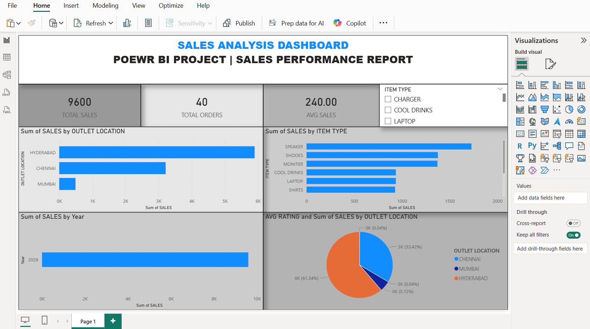

Power BI Sales Dashboard Project

Project Overview
I created this Sales Dashboard using Power BI to understand sales data in a simple way. This dashboard shows total sales, profit, and number of orders with clear visuals.

  Tools Used
  *Power BI  
  * Excel  

  Key Features
 * KPI cards to show Total Sales, Profit, and Orders  
 * Bar chart to compare sales by category  
 * Pie chart to show sales share  
 * Simple and clean dashboard design  

  Business Insights
 * Easy to see overall sales performance  
 * Helped find which category is performing better  
 * Shows profit and order details clearly  

  What I Learned
 * How to create KPI cards  
 * How to build charts in Power BI  
 * How to design a neat and professional dashboard  
 * Basic understanding of data visualization
   
Dashboard Preview

Cricket Player Performance Dashboard

Project Overview
This project is an interactive Cricket Player Performance Dashboard created using Power BI.
The dashboard analyzes player statistics such as runs, balls faced, strike rate, fours, and sixes to evaluate overall performance.

        Tools Used
	      Power BI
	      Excel

Dataset Details
The dataset contains player-level performance data including:
	•	Player Name
	•	Total Runs
	•	Balls Faced
	•	Fours
	•	Sixes
	•	Strike Rate

Key Features
	•	KPI Cards to display:
	•	Total Runs
	•	Total Balls Faced
	•	Average Strike Rate
	•	Bar Chart to compare runs scored by each player
	•	Bar Chart to analyze strike rate by player
	•	Stacked Bar Chart to compare number of fours and sixes
	•	Clean and structured dashboard layout

DAX Measures Created
	•	Total Strike Rate using DIVIDE function
	•	Aggregated measures for runs and balls faced

Business Insights
	•	Identified top-performing players based on total runs
	•	Compared batting efficiency using strike rate
	•	Analyzed boundary contribution (fours and sixes)
	•	Evaluated overall batting impact of players

What I Learned
	•	Creating calculated measures using DAX
	•	Using DIVIDE function to avoid errors
	•	Designing KPI cards and bar charts
	•	Structuring a dashboard layout professionally
	•	Presenting sports data in a meaningful way

This project demonstrates my ability to clean data, create measures, and design analytical dashboards using Power BI.
Dashboard1.png

